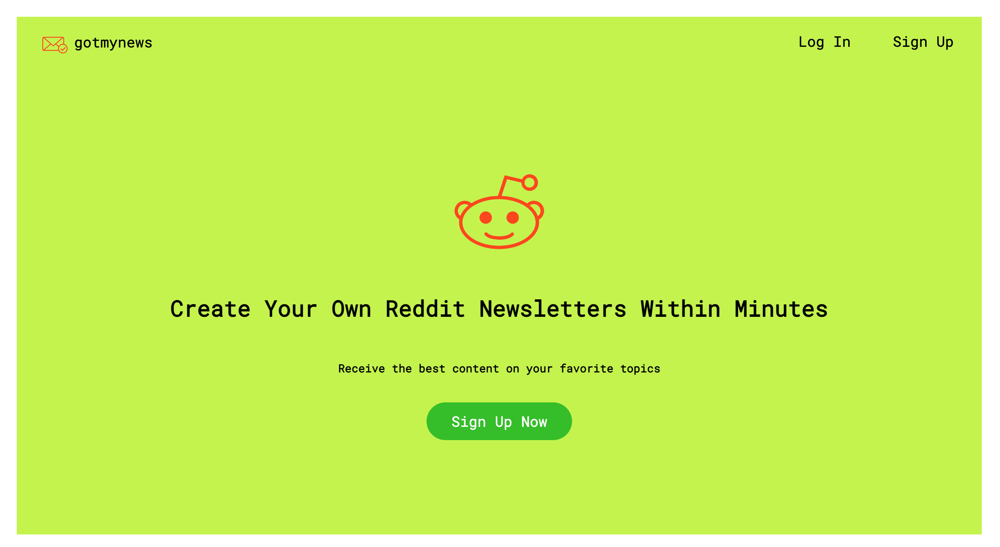
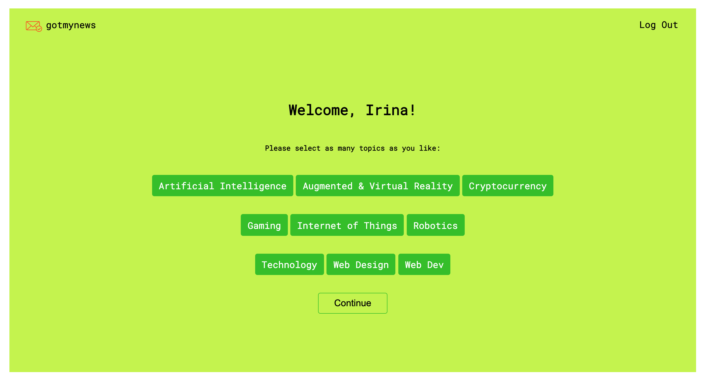

<h1 align="center">GOTMYNEWS</h1>

<h2 align="center">Gotmynews is a project that creates weekly newsletters from Reddit based on topics selected by user.
</h2>

Check out the  <a href="https://gotmynews.herokuapp.com" target="_blank">website</a>

Made with   &#124; Built with ❤️

<h1>👤 User flow</h1>  

User will be able to create personal newsletters within minutes:

1. Subscribe with email  

  

1. Pick topics

  

1. Recieve weekly email digest with top posts from Reddit 

  

 

<h1>⚙️ Development</h1> 

This project made with:  
 

- [Flask](https://github.com/pallets/flask) web framework.
- [SendGrid-python](https://github.com/sendgrid/sendgrid-python/blob/main/README.md) library
- [Reddit API](https://www.reddit.com/dev/api/) [/r/subreddit]/top
- [Heroku Scheduler](https://devcenter.heroku.com/articles/scheduler) add-on for running jobs  
  
 
To run the project, you need to create a <code>.env</code> with following variables:  

<pre>
REDDIT_REFRESH_TOKEN = ...
USER_CREDENTIALS = ...
SENDGRID_API_KEY = ...
</pre>

After that you will be able to make API requests to Reddit and Sendgrid.  

In order to deploy the project, you can create account on Heroku and after install add-ons: Heroku Postgres and Heroku Scheduler.
 

➡️  This is the capstone project 1 for the course Software Engineering at Springboard
 

